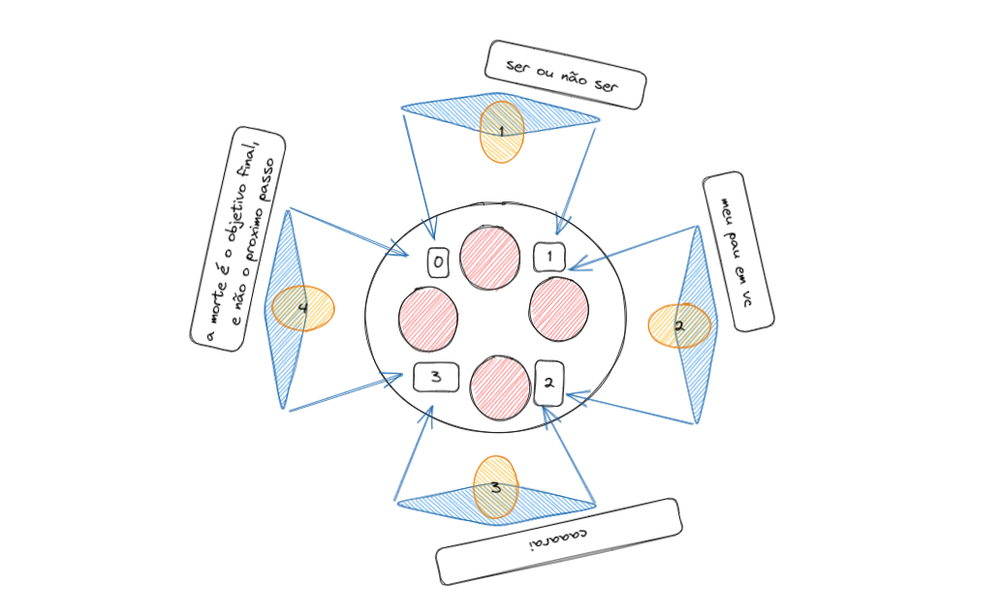

    

    
    
    
    

# Philosophers

This project is about using threads and mutexes to solve the [Dining Philosophers problem](https://en.wikipedia.org/wiki/Dining_philosophers_problem).

## Introduction

The project consists of simulating the behavior of philosophers at a dinner table. Each philosopher has a fork on his left and right. To eat, a philosopher needs both forks. To avoid deadlock, a philosopher must always pick up the fork on his right first, then the fork on his left. When he finishes eating, he puts down both forks so that the other philosophers can eat. The simulation stops when a philosopher dies.

    

## How to use
- Clone the repository `git clone https://github.com/iLucasPires/philo.git`
- Enter the project folder `cd philo`
- Run `make` to compile the project
- Run `./philo <number_of_philosophers> <time_to_die> <time_to_eat> <time_to_sleep> [number_of_times_each_philosopher_must_eat]` to execute the program

## Requirements
- [C compiler (gcc or clang)](https://gcc.gnu.org/)
- [Make](https://www.gnu.org/software/make/)

## Mandatory part
- [x] The program must not have any memory leaks and data races.
- [x] Each philosopher must be a thread
- [x] Any change of status of a philosopher must be written as follows: timestamp_philosopher_number status
- [x] The status can be: is eating, is sleeping, is thinking, died
- [x] The timestamp is the time in milliseconds since the beginning of the simulation.
- [x] You can’t have more than 10 ms between the death of a philosopher and when it will print its death.
- [x] Each philosopher should eat at least 1 time before dying.
- [x] The simulation stops when a philosopher dies.
- [x] All philosophers must eat at least number_of_times_each_philosopher_must_eat times.

## Example

## TODO
- [ ] Add more tests
- [ ] better performance
